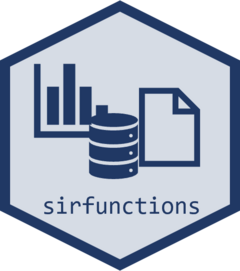

# sirfunctions 

<br>


## Overview

The `sirfunctions` package contains key functions used by the Surveillance, Innovation, and Research (SIR) team within the Polio Eradication Branch (PEB) at the Centers for Disease Control and Prevention (CDC). It includes functions to download cleaned global polio data from the World Health Organization (WHO) Polio Information System (POLIS) and geographic files. In addition, the package contains functions to visualize important epidemiological trends and perform key performance indicators such as NPAFP rates, EV rates, and stool adequacy.

## Installation and Updates

Ensure that `devtools` is installed (if not run `install.packages("devtools")`). Then run the following command:

```         
devtools::install_github("nish-kishore/sirfunctions")
```

Remember to update `sirfunctions` regularly. If no update is needed, the line of code above will automatically skip.

## Usage

Use any function developed in this package using: `sirfunctions::{function}`

For example: `sirfunctions::edav_io(io = "list")`

You can find the documentation for any function by running: `?sirfunctions::{function}`

For example: `?sirfunctions::edav_io`

## Functions

Here is a current list of core functions included in `sirfunctions` with
brief descriptions.

**NOTE**: Any functions getting data or those that interact with EDAV require authenticated connection to CDC EDAV resources.

### Get Data

1)  `get_all_polio_data`: this is the primary function which loads all
    recent polio data. Parameters can be used to specify date ranges,
    data selection and user verification.
2)  `edav_io`: perform key writing/reading/editing functions for EDAV
    from your R system.
3)  `load_clean_{resolution}_sp`: 'resolution\` can be *dist*, *prov* or
    *ctry*. Parameters can be used to specify date or spatial ranges as
    well as the output.
4)  `init_dr`: this is the primary function to initialize the desk
    review analytic pipeline. This function handles folder organization
    and download of data for a specific country. Visualization functions
    in the desk review will be downloaded as well.

### Communications

1)  `send_teams_message`: send a message to a teams channel with
    attachments.
2)  `upload_to_sharepoint`: upload a document to a sharepoint folder.
3)  `send_outlook_email`: send an email from the validated microsoft
    account.

### Key calculations

1)  `extract_country_data`: expects a 'raw.data' object that is
    generated by `get_all_polio_data()` which includes spatial data.
    Generates a country specific data file along with relevant spatial
    objects.
2)  `f.ev.rate.01`: calculate the enterovirus detection rate using CDC
    cleaned environmental surveillance data.
3)  `f.npafp.rate.01`: calculate the non-polio (NP) acute flaccid
    paralysis (AFP) rate accounting for person-time at risk using CDC
    cleaned AFP data and appropriately matched population data.
4)  `f.stool.ad.01`: calculate stool adequacy using CDC cleaned acute
    flaccid paralysis (AFP) data.
5)  `f.timely.detection.01`: calculate the timeliness of detection of
    cases using CDC cleaned acute flaccid paralysis (AFP) data.
6)  `f.timely.01`: calculate the timeliness of stool data using only epi
    data.  

### Visualization
1)  `create_emergence_group_gif`: function to visualize the spread of
    specific emegrence groups.
2) `generate_adhoc_map`: function to visualize outbreaks.

### Helper functions

1)  `test_EDAV_connection`: Evaluates the speed of connection that users
    have with the CDC EDAV system.
2)  `f.color.schemes`: Adds Standard color schemes used in figure
    creation by the SIR team.
3)  `f.expand.bbox`: Expands a geographic bounding box generated for
    maps.
4)  `f.metadata.tag`: Adds a tag using information from the CDC
    generated 'raw.data' file to ggplot and flextable objects.
5)  `f.plot.looks`: Adds standard themes used in figure creation by the
    SIR team.
6) `duplicate_check`: checks for duplicates in the output of `get_all_polio_data()`.
7) `check_afp_guid_ctry_data`: checks for GUIDS present in the AFP dataset but not in the population files.
8) `fix_ctry_data_missing_guids`: fixes unknown GUIDS in the AFP linelist by
   obtaining GUIDs found in the pop files based on province and district names for specific years.
10) `compress_png`: compress PNG files. _Note: requires installation of the pngquant software._
11) `get_diff_cols`: get the columns where records differ in a group. Useful for identifying where duplicates differ.

## Release Schedule
-   Please see the
    [Releases](https://github.com/nish-kishore/sirfunctions/releases)
    page for specifics on previous releases.

## Contact

Please send a message to Nishant Kishore at
[ynm2\@cdc.gov](mailto:ynm2@cdc.gov) for any questions or
queries.

## Public Domain Standard Notice

This repository constitutes a work of the United States Government and
is not subject to domestic copyright protection under 17 USC § 105. This
repository is in the public domain within the United States, and
copyright and related rights in the work worldwide are waived through
the [CC0 1.0 Universal public domain
dedication](https://creativecommons.org/publicdomain/zero/1.0/). All
contributions to this repository will be released under the CC0
dedication. By submitting a pull request you are agreeing to comply with
this waiver of copyright interest.

## License Standard Notice

The repository utilizes code licensed under the terms of the Apache
Software License and therefore is licensed under ASL v2 or later.

This source code in this repository is free: you can redistribute it
and/or modify it under the terms of the Apache Software License version
2, or (at your option) any later version.

This source code in this repository is distributed in the hope that it
will be useful, but WITHOUT ANY WARRANTY; without even the implied
warranty of MERCHANTABILITY or FITNESS FOR A PARTICULAR PURPOSE. See the
Apache Software License for more details.

You should have received a copy of the Apache Software License along
with this program. If not, see
<http://www.apache.org/licenses/LICENSE-2.0.html>

The source code forked from other open source projects will inherit its
license.

## Privacy Standard Notice

This repository contains only non-sensitive, publicly available data and
information. All material and community participation is covered by the
[Disclaimer](https://github.com/CDCgov/template/blob/master/DISCLAIMER.md)
and [Code of
Conduct](https://github.com/CDCgov/template/blob/master/code-of-conduct.md).
For more information about CDC's privacy policy, please visit
[http://www.cdc.gov/other/privacy.html](https://www.cdc.gov/other/privacy.html).

## Contributing Standard Notice

Anyone is encouraged to contribute to the repository by
[forking](https://help.github.com/articles/fork-a-repo) and submitting a
pull request. (If you are new to GitHub, you might start with a [basic
tutorial](https://help.github.com/articles/set-up-git).) By contributing
to this project, you grant a world-wide, royalty-free, perpetual,
irrevocable, non-exclusive, transferable license to all users under the
terms of the [Apache Software License
v2](http://www.apache.org/licenses/LICENSE-2.0.html) or later.

All comments, messages, pull requests, and other submissions received
through CDC including this GitHub page may be subject to applicable
federal law, including but not limited to the Federal Records Act, and
may be archived. Learn more at <http://www.cdc.gov/other/privacy.html>.

## Records Management Standard Notice

This repository is not a source of government records, but is a copy to
increase collaboration and collaborative potential. All government
records will be published through the [CDC web
site](http://www.cdc.gov).
